[](https://doi.org/10.5281/zenodo.4983257)

## Visual network with weight weigthed based on distence: additions to the main branch
Use Swarm_class.py to generate the network class first. It can only run vusial networks here and there are tree additional relevant functions added: 

### 1. Visualise a node with weighted links

```python
#Provide parameters for the swarm
mySwarm=Swarm(n=121, dist=5, setup='grid', noise_pos=0.1, noise_phi=100, alpha=2)
visual_amat,visual_network=mySwarm.binary_visual_network(threshold=0.01,return_networkX=True)
```

```python
#Plot the figure
fig,ax=plt.subplots(1, figsize=(10,10))
mySwarm.draw_weighted_network(visual_network,alpha=2,fig=fig,ax=ax,ellipse_edgecolor='k')
```

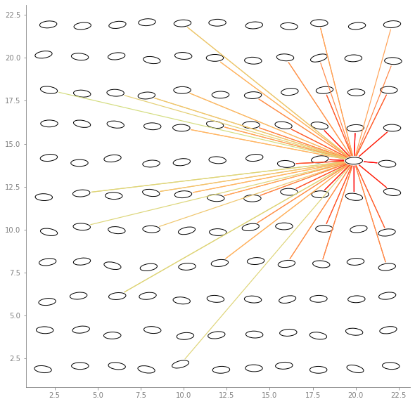

### 2. Visualise four regions of a node

```python
plt.figure(figsize=(10, 10))
mySwarm=Swarm(n=64, dist=2, setup='grid', noise_pos=0, noise_phi=0) #Only works for noise_pos=0!
visual_amat,visual_network=mySwarm.binary_visual_network(threshold=0.01,return_networkX=True)
mySwarm.draw_regions(visual_network, ellipse_edgecolor='k')
```

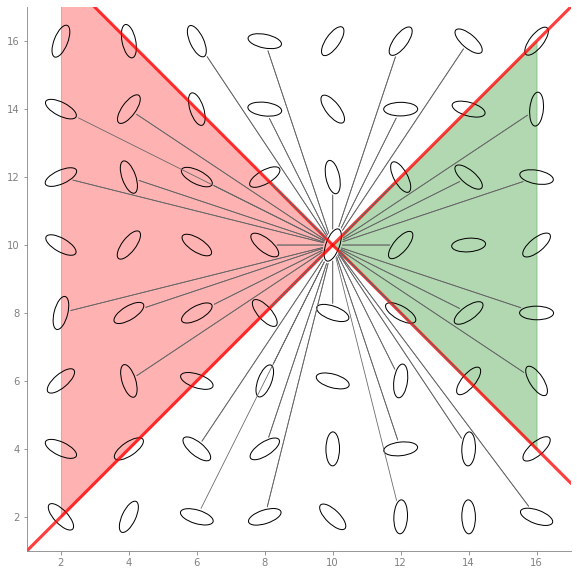

### 3. Calculate the average number of links and their weights in the four regions

```python
mySwarm=Swarm(n=121, dist=3, setup='grid', noise_pos=0.1, noise_phi=100, alpha=0)
visual_amat,visual_network=mySwarm.binary_visual_network(threshold=0.01,return_networkX=True)
node_numbers, node_weights = mySwarm.get_angles(visual_network, alpha=0, ellipse_edgecolor='k')
```

```python
#To collect data from different networks with different parameters, this code can be used 
distances = [1.5, 3, 5, 11, 15, 36, 50, 110]
alphas = [1, 2, 4]
trials = 100
area_rates = {}
area_weights = {}

for a in alphas:
    for d in distances:
        for n in range(trials):
            numbers = []
            weights = []
            mySwarm=Swarm(n=225, dist=d, setup='grid', noise_pos=0, noise_phi=0, alpha=a)
            visual_amat,visual_network=mySwarm.binary_visual_network(threshold=0.01,return_networkX=True)
            node_numbers, node_weights = mySwarm.get_angles(visual_network,alpha=a,ellipse_edgecolor='k')
            numbers.append(node_numbers)
            weights.append(node_weights)

        df_numbers = pd.DataFrame(numbers)
        number_per_area = dict(df_numbers.mean())
        area_rates['dist {} alpha {}'.format(d, a)] = number_per_area

        df_weights = pd.DataFrame(weights)
        weights_per_area = dict(df_weights.mean())
        area_weights['dist {} alpha {}'.format(d, a)] = weights_per_area
```

```python
#One of the ways to visualise the results 
#First, format the data into a readable matrix
names = list(area_rates.keys())
areas = list(area_rates.values())
matrix = np.empty((len(names), len(area_names)))

data = []
for i in range(len(areas)):
    area_names = list(areas[i].keys())
    area_values = list(areas[i].values())
    data.append(area_values)

for i in range(len(data)):
    rows = data[i]
    for j in range(len(rows)):
        matrix[i][j] = rows[j]
```

```python
#Visualization
fig = plt.subplots(figsize =(12, 8))
# Set position of bar on X axis
R = matrix.T[0]
L = matrix.T[1]
U = matrix.T[2]
D = matrix.T[3]

br1 = np.arange(len(R))
br2 = [x + barWidth for x in br1]
br3 = [x + barWidth for x in br2]
br4 = [x + barWidth for x in br3]
 
# Make the plot
plt.bar(br1, R, width = barWidth, label ='Right')
plt.bar(br2, L, width = barWidth, label ='Left')
plt.bar(br3, U, width = barWidth, label ='Up')
plt.bar(br4, D, width = barWidth, label ='Down')
 
# Adding Xticks
plt.xlabel('Distance, low polarization', fontweight ='bold', fontsize = 15)
plt.ylabel('Average number of nodes', fontweight ='bold', fontsize = 15)
plt.xticks([r + barWidth for r in range(len(R))],names)
plt.legend()
```

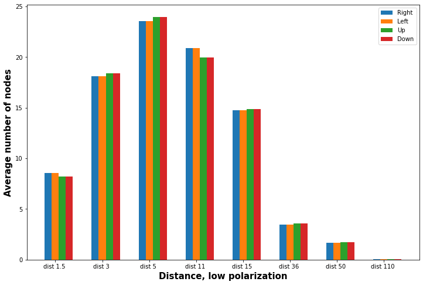


## Contagion process

Running the contagion in the models is barely different, the only addition is the parameter


```python
N=swarm.n
init_infected_nodes = np.random.choice(N, 5)
alpha = 1
simple_params=InitParameters(simtime=50,N=N,contagion_type='simple',recovery_rate=0.2,
                         init_infected_nodes=init_infected_nodes, infection_rate=0.5, alpha=alpha,
                         threshold_complexContagion=None,steepness_complexContagion=None)

fig,ax=plt.subplots(1)
for i in range(10):
    outdata = SingleRun(simple_params, adjM=adjacency_matrix, alpha=alpha, pos=swarm.pos.T)
    time=outdata['time']
    infected_fraction=(np.array(outdata['ninf']))/swarm.n
    recovered_fraction=(np.array(outdata['nrec']))/swarm.n
    ax.plot(time, infected_fraction,color='r')
    ax.plot(time, recovered_fraction,color='b')
```


### 2. How to generate a visual, metric & topological network with a specific threshold

The Swarm class has a function for the generation of each network type (see below). Each has the option to either return only the adjacency matrix or to additionally return a networkX DiGraph, which can be used for plotting the network or to obtain network measures.


```python
mySwarm=esw.Swarm(N=9)
```


```python
visual_amat,visual_network=mySwarm.binary_visual_network(threshold=0.02,return_networkX=True)
print(np.matrix(visual_amat))
fig,ax=plt.subplots(1)
mySwarm.draw_binary_network(visual_network,fig=fig,ax=ax,ellipse_edgecolor='indigo',show_index=True)
```

  
    [[0 1 0 1 1 1 0 1 0]
     [1 0 1 1 1 1 1 0 1]
     [0 1 0 1 1 1 0 1 0]
     [1 1 1 0 1 0 1 1 1]
     [1 1 1 1 0 1 1 1 1]
     [1 1 1 0 1 0 1 1 1]
     [0 1 0 1 1 1 0 1 1]
     [1 0 1 1 1 1 1 0 1]
     [0 1 0 1 1 1 0 1 0]]


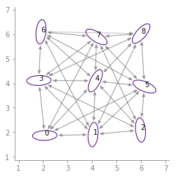


```python
metric_amat,metric_network=mySwarm.binary_metric_network(threshold=3,return_networkX=True)
print(np.matrix(metric_amat))
fig,ax=plt.subplots(1)
mySwarm.draw_binary_network(metric_network,fig=fig,ax=ax,ellipse_edgecolor='coral',show_index=True)
```

    [[0 1 0 1 0 0 0 0 0]
     [1 0 1 0 1 1 0 0 0]
     [0 1 0 0 1 1 0 0 0]
     [1 0 0 0 1 0 1 1 0]
     [0 1 1 1 0 1 1 1 1]
     [0 1 1 0 1 0 0 1 1]
     [0 0 0 1 1 0 0 1 0]
     [0 0 0 1 1 1 1 0 1]
     [0 0 0 0 1 1 0 1 0]]


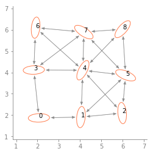


```python
topological_amat,topological_network=mySwarm.binary_topological_network(threshold=2,return_networkX=True)
print(np.matrix(topological_amat))
fig,ax=plt.subplots(1)
mySwarm.draw_binary_network(topological_network,fig=fig,ax=ax,ellipse_edgecolor='seagreen',show_index=True)
```

    [[0 1 0 1 0 0 0 0 0]
     [1 0 1 0 0 0 0 0 0]
     [0 1 0 0 0 1 0 0 0]
     [1 0 0 0 0 0 1 0 0]
     [0 0 0 0 0 1 0 1 0]
     [0 0 1 0 1 0 0 0 1]
     [0 0 0 1 0 0 0 0 0]
     [0 0 0 0 1 0 1 0 1]
     [0 0 0 0 0 0 0 1 0]]


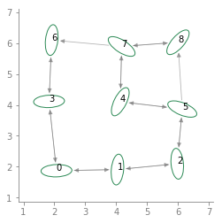


### 3. Requirements for the high density regime (overlap elimination)

If the initially generated positions contain overlaps, these are eliminated via _eliminate_overlaps() (this happens automatically if they are detected at initialization with eliminate_overlaps=True, which is default)
The overlap elimination uses code adapte from Palachanis et. Al (https://link.springer.com/article/10.1007/s40571-015-0064-5). See the readme within that publication for instructions on how to install the necessary packages.


```python
x=np.arange(2,18,1,dtype=float)
y=np.array([2.,2.5,3,4,5])
pos=np.array([[a,b] for a in x for b in y])
phi=np.random.random(len(x)*len(y))*2.*np.pi
# initialize swarm with above (overlapping) positions (pos) and orientations (phi)
mySwarm=esw.Swarm(pos=pos,phi=phi,w=0.5,eliminate_overlaps=False)
# plot the swarm with intersecting ellipses (black line)
mySwarm.plot_ellipses(show_eyes=False)
# remove the intersections and replot (in red)
mySwarm=esw.Swarm(pos=pos,phi=phi,w=0.5,eliminate_overlaps=True)
mySwarm.plot_ellipses(alpha=0.5,color='r')
plt.gcf().set_size_inches(10,10)
```


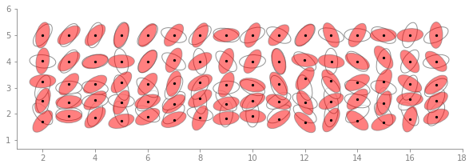


### 4. Example of how to use the code to generate Figures 1 to 3 from the Paper

Here, we generate a low resolution version of the plot in Figure 1C) (average in-degree vs. density) for a smaller group size (N=36) and only one threshold value for each network type


```python
visual_threshold=0.05
metric_threshold=3
topological_threshold=3
distances=np.arange(0.5,5.6,1)
                    
density=[]
avg_indegree_visual=[]
avg_indegree_metric=[]
avg_indegree_topological=[]

#Let's also plot the spatial configurations we create
fig,ax=plt.subplots(1,len(distances))

for i,dist in enumerate(distances):
    swarm=esw.Swarm(N=36,noise_pos=0.5,noise_phi=0.1,w=0.3,dist=dist)
    visual_amat=swarm.binary_visual_network(threshold=visual_threshold)
    metric_amat=swarm.binary_metric_network(threshold=metric_threshold)
    topological_amat=swarm.binary_topological_network(threshold=topological_threshold)
    this_density=swarm.density()
    density.append(this_density)
    avg_indegree_visual.append(np.mean(np.sum(visual_amat,axis=0)))
    avg_indegree_metric.append(np.mean(np.sum(metric_amat,axis=0)))
    avg_indegree_topological.append(np.mean(np.sum(topological_amat,axis=0)))
    # this is just plotting the swarm, not necessary to create the Figure 1C plot
    swarm.plot_ellipses(ax=ax[i],show_eyes=False)
    ax[i].set_title('density=%1.3f'%this_density)
    
fig.set_size_inches(13,4)
```

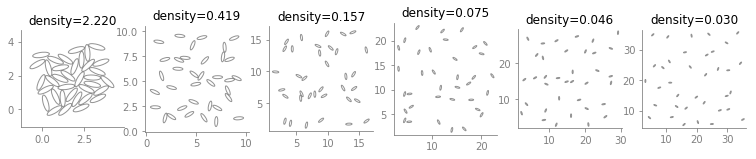


```python
fig,ax=plt.subplots(1)
ax.plot(density,avg_indegree_visual,c='indigo',marker='o')
ax.plot(density,avg_indegree_metric,c='coral',marker='o')
ax.plot(density,avg_indegree_topological,c='seagreen',marker='o')
ax.set_xscale('log')
ax.set_ylabel('avg. in-degree')
ax.set_xlabel('density [BL$^2$]')
```

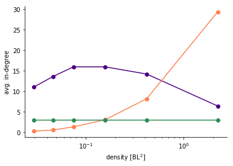


#### Other network measures

Let's use one metric network to show the calculation of other network measures:


```python
swarm=esw.Swarm(N=36,eliminate_overlaps=False)
adjacency_matrix,network=swarm.binary_metric_network(return_networkX=True)

polarization=swarm.polarization()
avg_shortest_path=nx.average_shortest_path_length(network)
avg_clustering=np.mean(np.array(list(nx.clustering(network).items()))[:,1])
avg_rel_link_length=np.sum(swarm.metric_distance_center*adjacency_matrix)/(np.sum(adjacency_matrix)*np.amax(swarm.metric_distance_center))
```


```python
print('polarization: %1.4f'%polarization)
print('avgerage shortest path; %1.4f'%avg_shortest_path)
print('average clustering coefficient: %1.4f'%avg_clustering)
print('average relative link length: %1.4f'%avg_rel_link_length)
```

    polarization: 0.1920
    avgerage shortest path; 1.7873
    average clustering coefficient: 0.7033
    average relative link length: 0.2251


### 5. Running contagion dynamics on the networks 

#### 5.1. Simple Contagion

```python
swarm=esw.Swarm(N=81)
adjacency_matrix,network=swarm.binary_metric_network(return_networkX=True,threshold=5)

simtime=100
N=swarm.n
contagion_type='simple'
recovery_rate=0.03
init_infected_nodes=[0,4,5] # ids of initially infected nodes
infection_rate = 0.3
threshold_complexContagion=None
steepness_complexContagion=None

SIR_parameters=cc.InitParameters(simtime=simtime,
                                 N=N,
                                 contagion_type=contagion_type,
                                 recovery_rate=recovery_rate,
                                 init_infected_nodes=init_infected_nodes, 
                                 infection_rate=infection_rate,
                                 threshold_complexContagion=threshold_complexContagion,
                                 steepness_complexContagion=steepness_complexContagion)

# Here we generate 10 cascades and plot the temporal evolution of the activated fraction of individuals
fig,ax=plt.subplots(1)
for i in range(10):
    outdata = cc.SingleRun(SIR_parameters, adjM=adjacency_matrix, pos=swarm.pos.T)
    time=outdata['time']
    activated_fraction=(np.array(outdata['ninf'])+np.array(outdata['nrec']))/swarm.n
    ax.plot(time,activated_fraction,color='r',alpha=0.2)
```

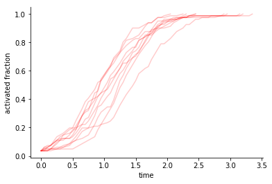


cc.SingleRun returns a dictionary with the following entries:

- outdata['state'] contains a time series of the state of each node with 1=infected, 0=susceptible, -1=recovered
- outdata['ninf'] number of infected individuals at time t
- outdata['nrec'] number of recovered individuals at time t
- outdata['time'] time t
- outdata['edgelist'] the adjacency matrix as a list of existing network links

From these the time to 75% activation (infected + recovered individuals) is calculated


#### 5.2 Complex Contagion


```python
swarm=esw.Swarm(N=81)
adjacency_matrix,network=swarm.binary_metric_network(return_networkX=True,threshold=5)

simtime=100
N=swarm.n
contagion_type='complex_fractional'
recovery_rate=0.03
init_infected_nodes=[0,4,5] # ids of initially infected nodes
infection_rate = 0.3
threshold_complexContagion=0.3
steepness_complexContagion=10
```


```python
SIR_parameters=cc.InitParameters(simtime=simtime,
                                 N=N,
                                 contagion_type=contagion_type,
                                 recovery_rate=recovery_rate,
                                 init_infected_nodes=init_infected_nodes, 
                                 infection_rate=infection_rate,
                                 threshold_complexContagion=threshold_complexContagion,
                                 steepness_complexContagion=steepness_complexContagion)

# Here we generate 10 cascades and plot the temporal evolution of the activated fraction of individuals
fig,ax=plt.subplots(1)
for i in range(10):
    outdata = cc.SingleRun(SIR_parameters, adjM=adjacency_matrix, pos=swarm.pos.T)
    time=outdata['time']
    activated_fraction=(np.array(outdata['ninf'])+np.array(outdata['nrec']))/swarm.n
    ax.plot(time,activated_fraction,color='r',alpha=0.2)
```

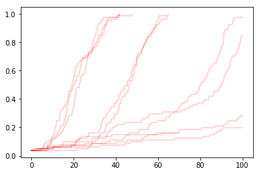


```python

```
